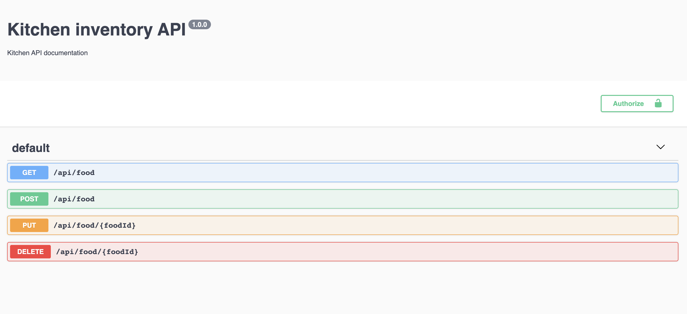

# CRUD using Node Express Mongo
> A simple restful NodeJS CRUD, with expressJS, mongoDB and Swaggers Docs-


[![NPM Version][npm-image]][npm-url]
[![Build Status][travis-image]][travis-url]
[![Downloads Stats][npm-downloads]][npm-url]

This project act as a API service for Kitchen Inventory Angular App (But can be modified for any CRUD operations by modifying model and controller files).This project uses swaggers npm packages for generating swagger docs at /api-docs endpoint 



## Installation

once repo is cloned cd to project and run
```sh
npm install
```

## Development setup

To start app run command

```sh
npm start
```
and navigate to <http://localhost:8080/api-docs/>


## Usage example

For Adding an item in Db

For Getting items from Db

For Updating an item in Db

For Deleting an item in Db


## Meta

Your Name – [@YourTwitter](https://twitter.com/ikhlaq201) – ikhlaq201@gmail.com

[https://github.com/ikhlaq1](https://github.com/ikhlaq1/)

## Contributing

1. Fork it
2. Create your feature branch (`git checkout -b feature/fooBar`)
3. Commit your changes (`git commit -am 'Add some fooBar'`)
4. Push to the branch (`git push origin feature/fooBar`)
5. Create a new Pull Request

<!-- Markdown link & img dfn's -->
[npm-image]: https://img.shields.io/npm/v/datadog-metrics.svg?style=flat-square
[npm-url]: https://npmjs.org/package/datadog-metrics
[npm-downloads]: https://img.shields.io/npm/dm/datadog-metrics.svg?style=flat-square
[travis-image]: https://img.shields.io/travis/dbader/node-datadog-metrics/master.svg?style=flat-square
[travis-url]: https://travis-ci.org/dbader/node-datadog-metrics
[wiki]: https://github.com/yourname/yourproject/wiki
